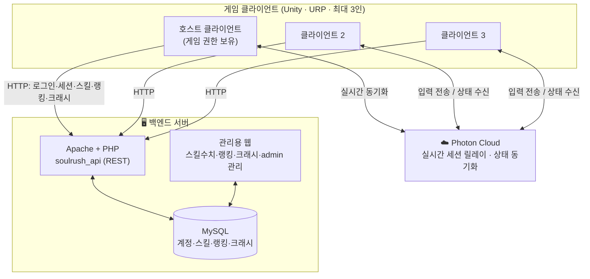

# Soul Rush — 웹 PPT 제작용 정리 문서

> **목적**: 웹 PPT를 만드는 작업자(Claude)에게 전달할 프로젝트 요약본.
> **원본 PPT**(`Souls.pdf`, 13p)의 구조·내용을 뼈대로 삼고, 현재 코드베이스에서 확인한
> 실제 아키텍처·기능·시스템을 채워 넣었다. 세부 구현/코드는 의도적으로 배제했다.
>
> - 게임 정식 명칭: **Soul Rush** (`ServerSouls`는 저장소 이름일 뿐)
> - 원본 PPT는 오래된 버전이라 **최신 기능이 일부 빠져 있어**, 코드 기준으로 보강했다.
>   원본에 없던 최신 기능은 `[NEW]`로 표시해 발표 시 강조하기 쉽게 했다.
> - 각 섹션 = 슬라이드 1~2장 단위. 원본 PPT 목차 순서를 따르되, **기술 스택 뒤에 Software Architecture를 추가**했다.
>
> **📎 이미지/영상 첨부 안내 (PPT 제작자에게)**
> 스크린샷·다이어그램 이미지·데모 영상 등 **시각 자료는 발표자가 직접 나중에 넣는다.**
> 따라서 PPT를 만들 때 해당 위치에 **`🖼️ [이미지 자리]` / `🎬 [영상 자리]` 형태의 자리표시자(placeholder)를 비워 두고**,
> 나중에 파일만 끼워 넣으면 되도록 만들어 줄 것. 아래 본문에서 자리표시자가 필요한 지점은 `🖼️`/`🎬`로 표시해 두었다.

---

## 원본 PPT 목차 → 이 문서 구성

1. 팀원 소개
2. 게임 소개
3. 기술 스택
4. **Software Architecture (신규 추가)** — 전체 구조 + 서버 구조
5. 현재 진행도 (플레이어 / 스킬 / 보스·맵 / 서버·백엔드 / 인게임·UI)
6. Game Demo
7. TODO List & Future Work
8. Q&A

---

## 0. 표지

**Soul Rush**
멀티플레이(3인) 로그라이크 보스러시
제작: 양평화 · 임현빈 · 이주영

> 🖼️ [이미지 자리] 타이틀/키비주얼 (발표자 첨부 예정)

> 디자인 톤 제안: 다크 소울라이크 무드(어두운 배경 + 골드/앰버 포인트, 고딕). 보스전·로그라이크·데이터 확장성을 시각적으로 강조.

---

## 1. 팀원 소개 (슬라이드 1장)

| 팀원 | 역할 | 담당 |
|---|---|---|
| **양평화** | 팀장 | 서버, 보스, 맵 |
| **임현빈** | | 플레이어, 스킬 시스템, 카메라 |
| **이주영** | | UI/UX, 사운드 |

---

## 2. 게임 소개 (슬라이드 2~3장)

**Soul Rush — 멀티플레이(3인) 로그라이크 보스러시**

**핵심 컨셉**
- 솔로 플레이 & 멀티 플레이(최대 3인 협동)
- 전투는 기본적인 **소울라이크**(구르기 회피·패링·스태미나 기반)
- 보스를 클리어할 때마다 **능력(스킬)을 골라** 강해진다 → **뱀파이어 서바이벌류**의 성장 재미
- **보스러시** 구조: 던전/전투방을 옮겨가며 연속으로 보스와 싸운다

**로그라이크 규칙**
- 다음 보스로 이동, **보스 레이드 최대 8판**(추후 변경 가능)
- 특수 능력은 **해금 조건 달성 / 다회차 플레이**로 영구 해금
- 한 판(런)이 끝나면 **런 중 획득 능력은 초기화**, 계정 **해금 상태는 유지**
- **랭킹(클리어 시간)** 존재 → 팀 단위 기록 경쟁

**핵심 게임 루프**
```
보스 처치 → 스킬 보상 선택/강화 → 다음 층 이동 → 난이도 상승 → … → 클리어 → 팀 랭킹 등록
```

---

## 3. 기술 스택 (슬라이드 1~2장)

| 영역 | 기술 |
|---|---|
| 엔진 / 렌더링 | Unity + **URP** (Universal Render Pipeline) |
| 실시간 네트워크 | **Photon** (호스트 권한형 멀티플레이 동기화) |
| 백엔드 서버 | **Apache + PHP + MySQL** (REST API `soulrush_api/`) + 관리용 웹 |
| 크래시 / 모니터링 | **Sentry** + 자체 CrashReporter |
| 데이터 | ScriptableObject(로컬 연출 에셋) + 서버 DB(밸런스 수치) **하이브리드** |

**설계 원칙 (전 시스템 공통)**
- **권한 분리**: 체력/데미지/스킬 사용 등 게임 상태는 서버·호스트가 확정, 클라이언트는 표시만.
- **데이터-표시 분리**: UI는 상태를 읽기만 하고 직접 수정하지 않는다.
- **모듈화**: 보스·스킬을 코드 수정 없이 ScriptableObject 조립만으로 양산·확장.

---

## 4. Software Architecture (소프트웨어 아키텍처) [NEW 섹션] (슬라이드 2~3장)

> Soul Rush는 **① 게임 클라이언트(Unity)**, **② 실시간 네트워킹(Photon)**, **③ 백엔드(Apache–PHP–MySQL)**
> 3개 축으로 구성된다. 두 서버 축은 **역할이 명확히 분리**되어 있다:
> - **Photon** = 전투 순간의 *실시간 동기화* (위치·상태·데미지 판정)
> - **Apache/DB** = 계정·진행·기록의 *영속 저장* (로그인·스킬 수치·랭킹·크래시)

### 4-1. 전체 구조도



### 4-2. 클라이언트 계층 구조 (Unity)

3계층으로 관심사를 분리한다.

| 계층 | 구성 | 역할 |
|---|---|---|
| **표현(Presentation)** | HUD/UI, 카메라·컷신, 이펙트/사운드 | 상태를 **읽어서 표시만** (수정 금지) |
| **게임플레이·네트워크** | NetworkPlayerController, NetworkBossCore, CombatSystem, 각종 Manager | 입력 처리·전투 판정·상태 확정 (**호스트 권한**) |
| **데이터** | ScriptableObject(스킬·보스패턴·인카운터), 세션 저장소 | 정적 데이터 + 런 중 동기화 상태 보관 |

### 4-3. 실시간 네트워킹 — Photon (호스트 권한 모델)

- Photon 클라우드 릴레이로 **3인 실시간 세션**을 연결. 한 클라이언트가 **호스트(권한)**, 나머지는 입력을 보내고 상태를 받는다.
- **데미지 판정 규칙**: 오버랩/사운드 등 판정은 모든 클라이언트가 로컬로 돌리되, **실제 데미지 적용은 호스트만** 수행 → 인원수만큼 중복 피해 방지.
- 방 생성/참가·씬 전환은 네트워크 매니저가 주도, 전환 중 로딩 커버로 끊김 은폐.

### 4-4. 백엔드 — Apache · PHP · MySQL

- **Apache 웹서버**가 `soulrush_api/`의 **PHP** 엔드포인트를 호스팅하고, **MySQL DB**와 통신.
- 게임 클라이언트는 **HTTP(REST)** 로 로그인/세션/스킬 수치/랭킹/크래시를 주고받음 (JSON 응답).
- 별도의 **관리용 웹**이 같은 DB를 조회·관리 (스킬 모듈 수치, 랭킹, 크래시 리포트, admin 권한).
- **하이브리드 데이터**: 연출값(애니메이션·VFX·사운드·히트박스)은 Unity 로컬 에셋, 밸런스 수치(쿨타임·데미지·레벨값)는 DB — 로그인 시 최신화.

### 4-5. 씬(진행) 흐름

```
scIntro → scLogin(서버 인증) → scLobbyMain(파티·스킬 카탈로그 로드)
  → scLoading(셰이더 예열 + 이펙트 풀 사전 생성)
  → 보스 스테이지(1층 → 보상 → 포탈 → 2층 → …, 층마다 난이도 상승)
  → scEnding(클리어 · 전투 소요 시간 · 팀 랭킹)
```

---

## 5. 현재 진행도

> 원본 PPT의 "현재 진행도"를 담당 영역별로 나눠, 코드에서 확인한 실제 시스템으로 보강.
> 각 진행도 슬라이드(플레이어·보스·UI 등)에는 🖼️ [이미지 자리] 스크린샷/GIF 자리표시자를 넣어 두고 발표자가 나중에 채운다.

### 5-1. 플레이어 (슬라이드 1~2장) — 임현빈

**기본 조작 & 전투**
- 3인칭 카메라 + **락온(Lock-On)** 시스템 (대상/부위 우선순위 순회)
- 이동/달리기/기기, **구르기(회피)**, 점프(제자리·전방), **패링**
- 기본 공격 **콤보 시스템** (애니메이션 진행률 기반 입력 창)
- 루트모션 기반 스킬 이동(슬라이드/스핀/점프 어택 등)

**성장/제작 툴**
- 에디터의 **컨텍스트 메뉴 · 윈도우 메뉴로 스킬 데이터 에셋 생성**, 애니메이터에 SO·트리거 **자동 연결**
- **Active / Passive / Utility** 타입 분류 → 타입별 인스펙터 메뉴 변경 + 세팅 확인용 **프리뷰 툴**

**컷신 & 부활**
- 보상 상자 개봉, 보스 진입, 통로 진입 컷신
- **사망 횟수 연동 부활 시스템**: 다운된 동료를 때려 부활, 방치 시 게이지 회복 (1인 부활 로직 개선 `[NEW]`)

**핵심 컴포넌트 구조**
- `NetworkPlayerController` (입력/이동/전투/루트모션/동기화/오디오 기능별 분리)
- `PlayerStats`(체력·스태미나·방어·부활), `PlayerStatusController`(버프/디버프 동기화)
- **조작 잠금 플래그**(Movement/Action/Skill/Camera/Interaction/All) — 컷신·UI가 컴포넌트를 직접 끄지 않고 잠금만 요청

### 5-2. 스킬 시스템 (슬라이드 1~2장) — 임현빈  `[대부분 NEW]`

원본의 "타입 분류 스킬"을 실제 구조로 구체화. **타입 분리 + 레벨별 수치 + DB 연동**이 최신 확장.

**3가지 타입 (ScriptableObject 모듈)**
- **Active** — 슬롯 장착·직접 사용 (쿨타임·스태미나·HitEvents·레벨별 데미지 배율)
- **Passive** — 획득/레벨업 시 스탯 상승 (체력·스태미나·방어·공격력 %)
- **Utility** — 회복·기본공격 해금 등 기능성

**하이브리드 데이터 + 해금**
- 연출값 = Unity 로컬 에셋 / 밸런스 수치 = 서버 DB (로그인 시 최신화, Bake로 에셋 갱신)
- `AbilityManager`가 전체 카탈로그 관리, **비트마스크로 계정 해금** (Active 1–19 / Passive 20–39 / Utility 40–60)

**획득 & 레벨업**
- 보스 처치 → `RewardManager`가 카드 후보 생성 → 하나 선택 → 등록/레벨업 (Lv.1→MaxLevel, 만렙 시 후보 제외)

### 5-3. 보스 & 맵 (슬라이드 2장) — 양평화 ⭐핵심

**보스 시스템**
- 보스 움직임 + **레이캐스트로 벽/바닥 판정**
- 행동 패턴(할퀴기·물기·점프 등)을 애니메이션으로 **조합하는 SO 패턴 모듈** → 기획자가 코드 없이 제작
- 보스 콜라이더 & 이펙트 작업
- **BossVisual(연출) ↔ Boss 스크립트(로직) 분리** = 서버/클라이언트 역할 분리 (`IBossVisual` 인터페이스)
- **2페이즈(광폭화)** 및 맵 기믹 상호작용

**공통 구조 & 최신 개선**
- `NetworkBossCore`(모든 보스의 부모): 상태머신(Sleep→WakeUp→전투↔패턴→2페이즈→Die), 체력 50%↓ 자동 광폭화
- **어그로 추적**: 10초 누적 딜량 1위에게 어그로 변경 `[NEW]`
- **BossAoEAttack**: 파티클과 동기화된 장판/폭발 판정 — 다단 히트(멀티히트) & 겹친 장판 중복 방지 `[NEW]`
- 보스 예시: Dragon(화염) · PolarDragon(빙결) · OrcAssassin(오크 암살자)

**로그라이크 진행(3단 매니저)**
- `BossEncounterData`(보스+맵 데이터) → `GameProgressionManager`(층수 관리·다음 보스 추첨·파티 이동) → `BossArenaManager`(층수 비례 체력/데미지 뻥튀기·보스 소환)
- **NextLevelPortal**(다음 층 이동) · **HealingAltar**(회복 제단 기믹)
- 새 보스 추가 = SO 등록 + 맵 배치만 (코드 불필요)

### 5-4. 서버 & 백엔드 (슬라이드 1~2장) — 양평화

- **Photon 방 생성/참가** — UI와 연동
- **로그인 DB 연동**, **로그 & DB 테이블 확인용 웹** 구현
- 웹에서 **DB · 스킬모듈 수치 · 랭킹 · 크래시 리포트** 관리 가능

**백엔드 엔드포인트 (`soulrush_api/`, Apache+PHP+MySQL)**

| 시스템 | 내용 | 상태 |
|---|---|---|
| 로그인/세션 | `login.php`, `check_session.php`, `update_skills.php` (인증·세션토큰·해금 비트마스크) | |
| 스킬 DB | `get_abilities.php`, `upload_ability.php` (타입별+레벨별, 공통1+타입별6 = 7 테이블) | `[NEW]` |
| 팀 랭킹 | `submit_ranking.php` (3인 클리어 팀 기록·소요시간 정렬·팀원 딜량) | `[NEW]` |
| Admin 권한 | `is_admin` (릴리즈 디버그 기능을 서버가 권위 판정) | `[NEW]` |
| 크래시 리포트 | exception/unhandled/**native_crash** 수집, 디스크 선저장 후 재전송 | `[NEW]` |

### 5-5. 인게임 · UI (슬라이드 1~2장) — 이주영

**인게임 UI**
- 플레이어 **HUD** 설계·제작 (체력/스태미나/스킬 슬롯/버프·디버프 아이콘)
- **인벤토리** 설계·제작 (카드 슬롯 + **툴팁 뷰** `[NEW]`), **스킬 아이콘** 제작, **락온 UI**
- HUD 원칙: 권한 컴포넌트가 확정한 상태를 **읽어 표시만**, `HUDManager`가 로컬/보스/파티원 데이터를 각 View에 전달

**로비·타이틀 & 플로우**
- 로비, 타이틀 설계·제작 / 인게임 진입 플로우 연결
- **인게임 옵션(설정)**: 그래픽·사운드 옵션(GameSettingsManager) `[NEW — 원본은 "임시 동작"이었음]`

**추가 시스템 `[NEW]`**
- **인게임 채팅 시스템**(ChatManager): 엔터로 채팅창 토글, 전역 채팅 표시
- **컷신 3종**: 보스 등장 · 골드 보상 상자 · 문 발차기(입장) — 카메라 연출 + 조작 잠금 연동
- **전투 결과 화면**: 승패 결과, **항복 투표**(SurrenderVoteManager), 게임오버, 임시 엔딩(scEnding)

---

## 6. Game Demo (슬라이드 1장)

> 🎬 [영상 자리] 실제 플레이 시연 영상 (발표자 첨부 예정)

- 실제 플레이 영상/시연 (원본 PPT 11p 위치)
- 추천 데모 흐름: 로비 매칭 → 보스전(락온·콤보·회피) → 보스 처치·보상 선택 → 다음 층 → 클리어·랭킹

---

## 7. TODO List & Future Work (슬라이드 1장)

**TODO (개선 예정)**
- 다양한 스킬 추가 및 조정
- 플레이어 공격 이펙트 추가 & 히트박스 조정
- 스킬/공격 그로기 수치 조절, 사운드 조정
- 컷신 조작 버그 수정
- 인게임 해상도 & 사운드 옵션 추가
- 스킬 아이콘 추가 제작, 인벤토리 키매핑 변경 기능
- 보스 패턴(Phase) 추가 + 이펙트 & 콜라이더
- 맵 & 플레이어 & 보스 에셋 변경

**Future Work (향후 계획)**
- 플레이어 직업 추가(무기)
- 인간형 보스 패턴 추가
- 튜토리얼
- 보스 전투방 추가

---

## 8. Q&A / Feedback (슬라이드 1장)

---

## 부록 A. 최적화 & 안정성 (선택 슬라이드 — 기술 어필용)

원본 PPT엔 없지만, 발표에서 기술력을 강조하고 싶으면 추가 권장.

- **이펙트 풀 + 셰이더 예열**: 로딩 시점에 미리 생성/컴파일 → 게임 중 첫 이펙트 렌더 끊김 제거
- **빌드 최적화 성과(실측)**: 셰이더 배리언트 폭증 정리로 **빌드 시간 3시간+ → 10분 미만**
- **Sentry 크래시 자동 수집**: 네이티브 크래시까지 다음 실행 때 보고

---

## 부록 B. 원본 PPT 대비 추가/발전된 기능 (발표 강조 포인트)

원본은 오래된 버전이라 아래 기능이 빠져 있음 — 발표에서 "이후 추가된 것"으로 강조하면 좋다.

- 스킬 **타입 분리(Active/Passive/Utility) + 레벨별 수치 + 서버 DB 연동**
- **팀 랭킹 + 전투 소요 시간** 측정/등록
- **크래시 리포트 서버 + Sentry** 자동 수집
- **관리용 웹**(DB·스킬수치·랭킹·크래시·admin)
- **인게임 채팅** 시스템
- **컷신 3종**(보스 등장·보상 상자·문 발차기)
- **인게임 옵션(그래픽·사운드)** 실동작
- 보스 **어그로 시스템**, **멀티히트/장판 중복 방지** 개선
- **최적화**(이펙트 풀·셰이더 예열·빌드 시간 단축)

---

## 부록 C. 슬라이드 매핑 요약 (PPT 목차 → 이 문서)

| # | 슬라이드 | 참조 |
|---|---|---|
| 1 | 표지 — Soul Rush | §0 |
| 2 | 팀원 소개 | §1 |
| 3–4 | 게임 소개 (컨셉·로그라이크 규칙) | §2 |
| 5 | 기술 스택 & 설계 원칙 | §3 |
| 6–7 | **Software Architecture** (전체 구조도 + 서버 구조) | §4 |
| 8–9 | 진행도 — 플레이어 / 스킬 | §5-1, §5-2 |
| 10–11 | 진행도 — 보스 & 로그라이크 ⭐ | §5-3 |
| 12 | 진행도 — 서버 & 백엔드 | §5-4 |
| 13 | 진행도 — 인게임 / UI | §5-5 |
| 14 | Game Demo | §6 |
| 15 | TODO & Future Work | §7 |
| 16 | (선택) 최적화 & 안정성 | 부록 A |
| 17 | Q&A | §8 |
