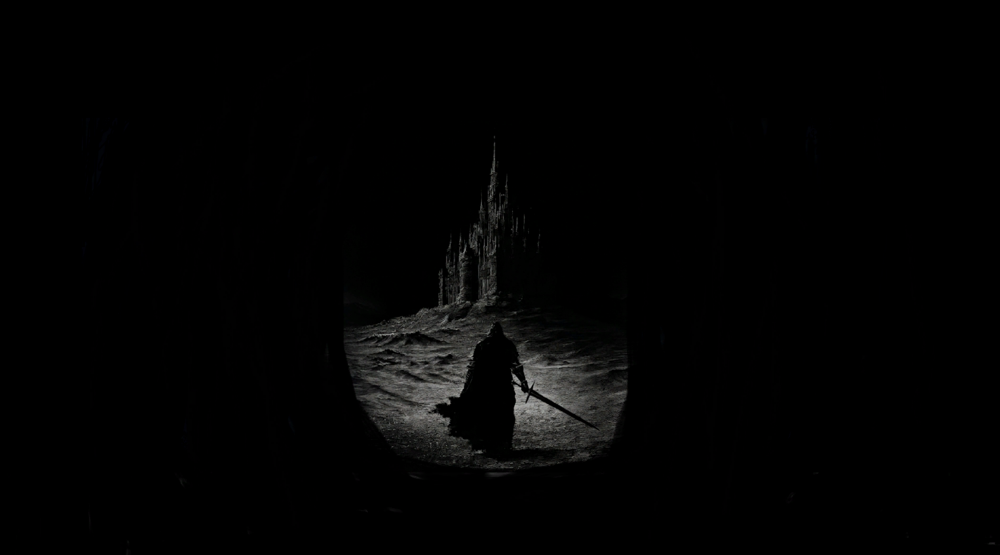

# Soul Rush 발표 덱 — 개발자용 편집 안내

`soul-rush-deck.html` 한 파일이 발표 덱 전체입니다. 외부 라이브러리 없이 순수 HTML/CSS/JS로
동작하며, 이미지·영상은 같은 폴더의 **`assets/`** 를 링크로 참조합니다(파일에 base64로 박지 않음).

```
docs/
├─ soul-rush-deck.html   ← 덱 본체 (이걸 편집)
├─ README.md             ← 이 문서 (개발자용)
└─ assets/               ← 이미지/GIF/영상 + assets/README.md (파일명 규칙)
```

미리보기: 브라우저로 `soul-rush-deck.html`을 열면 됩니다. 이미지가 뜨려면 `assets/` 폴더가
같이 있어야 합니다. 업로드 자동 저장 기능(아래)을 쓰려면 `file://` 대신 로컬 서버로 여세요:

```bash
cd docs
python -m http.server 8000     # http://localhost:8000/soul-rush-deck.html
```

---

## 1. 이미지를 링크로 넣는다 (base64 금지)

덱의 각 이미지 자리는 `<figure class="slot">` 이고, `` 의 `src` 가 `assets/파일명` 을 가리킵니다.

```html
<figure class="slot filled" data-default="assets/00-cover" data-kind="image">
  <div class="slot-frame" style="aspect-ratio: 1577 / 876;">
    <div class="slot-media-wrap">
         <!-- ← 이 링크 -->
    </div>
    ...
  </div>
</figure>
```

이미지를 바꾸거나 넣는 방법은 두 가지입니다.

**(A) 파일명 규칙으로 자동 연결** — `data-default="assets/이름"` 이 있는 슬롯은
`assets/이름.png|jpg|jpeg|gif|webp`(영상은 `.mp4`)를 순서대로 찾아 자동으로 붙입니다.
그 이름으로 `assets/` 에 파일만 넣으면 됩니다. (자세한 표는 `assets/README.md`)

**(B) 직접 링크 하드코딩** — `` 로 직접 적습니다.
`slot` 에 `filled` 클래스를 함께 붙여야 보입니다.

> ⚠️ **base64(`src="data:image/...;base64,..."`) 로 넣지 마세요.** HTML 용량이 수 MB로 불어납니다.
> 실수로 박혔다면 `assets/` 로 빼내고 링크로 되돌리세요(레포에 있던 base64는 이미 정리됨).

---

## 2. 편집 모드 UI로 넣기

우측 상단 **✏️ 편집 모드** → 각 자리를 클릭해 편집합니다.

- **글 수정**: 점선 표시된 텍스트(`.editable`)를 클릭해 바로 타이핑.
- **이미지/영상 업로드**: 빈 이미지 자리를 클릭 → 파일 선택. 업로드한 파일은 **`assets/` 에 링크로 연결**되며,
  아래 방식으로 실제 파일이 `assets/` 에 들어갑니다.
  - **로컬 서버(http/localhost) + 크롬/엣지**: 처음 한 번 `assets` 폴더 선택 창이 뜹니다.
    허용하면 고른 파일이 자동으로 `assets/` 에 복사됩니다.
  - **그 외(file:// 로 직접 열기, 파이어폭스/사파리)**: 고른 파일이 **다운로드**됩니다.
    그 파일을 직접 `docs/assets/` 로 옮기면 링크가 연결됩니다(안내 문구가 하단에 표시됨).
  - 어느 경우든 HTML에는 **`assets/파일명` 링크만** 남습니다(base64 아님).

### 섹션 추가 (한 슬라이드 안의 조각)

각 슬라이드 맨 아래(편집 모드)에 **`＋ 글 섹션`** / **`＋ 그림 섹션`** 두 버튼이 있습니다.

- **글 섹션**: 편집 가능한 텍스트 블록을 추가.
- **그림 섹션**: 이미지/영상 자리를 추가(파일 선택창이 바로 열림).

추가된 섹션은 손잡이(⠿)로 위치 이동, 우하단으로 크기 조절, 각 섹션의 `글`/`그림` 토글로 종류 전환,
`✕` 로 삭제할 수 있습니다.

### 새 슬라이드(페이지) 추가

상단바 **`＋ 새 슬라이드`**(편집 모드에서만 보임)를 누르면 **지금 보고 있는 슬라이드 바로 뒤에**
빈 슬라이드가 삽입되고, **뒤쪽 슬라이드 번호가 자동으로 +1** 됩니다(레일·페이저·eyebrow 번호 모두 갱신).
원하는 위치의 슬라이드로 먼저 이동한 뒤 버튼을 누르면 그 다음 자리에 들어갑니다.

### 저장

**⬇ 수정본 다운로드** 를 누르면 현재 상태가 `soul-rush-deck.html` 로 저장됩니다. 업로드 미디어는
`assets/` 링크로 기록되므로 파일이 커지지 않습니다. 저장한 HTML은 `assets/` 폴더와 **같이** 두어야
이미지가 보입니다.

---

## 3. HTML을 손으로 고쳐 슬라이드 추가하기

UI 대신 소스로 슬라이드를 넣으려면, 기존 `<section class="slide">` 블록을 복사해
원하는 위치에 붙이고 내용을 바꿉니다. 최소 형태:

```html
<section class="slide" id="p-new1" data-label="레일에 표시될 이름">
  <div class="slide-inner">
    <span class="eyebrow"><span class="idx">00</span> 카테고리 라벨</span>
    <h2 class="slide-title">슬라이드 제목</h2>
    <!-- 본문: panel(글) / slot(이미지) / grid-2 등 기존 슬라이드 구조 참고 -->
  </div>
</section>
```

- `id` 는 **고유**해야 하고(해시 이동에 사용), `data-label` 이 좌측 레일 목록에 나옵니다.
- `<span class="idx">` 번호는 신경 쓰지 않아도 됩니다 — 로드 시 순서대로 다시 매겨집니다
  (단, 소스 상 번호는 사람이 읽기 좋게 순서대로 맞춰두는 것을 권장).
- 이미지 자리는 위 **1번**의 `figure.slot` 구조를 그대로 복사해 쓰면 됩니다.
- `.slide-inner` 는 로드 시 편집 그리드(`deck-board`)로 자동 변환되므로, 별도 처리 없이
  편집·이동·크기조절이 붙습니다.

---

## 4. 구조 메모 (유지보수용)

- 스크립트는 두 블록으로 나뉩니다: **네비게이션/편집/미디어**(레일·페이저·업로드·다운로드·새 슬라이드)와
  **섹션 보드 엔진**(`deck-board` 그리드: 섹션 이동/크기/글·그림 전환/추가/삭제).
- 두 블록은 `window.__deck*` 몇 개로만 통신합니다:
  `__deckBuildBoard`(빈 슬라이드를 편집 보드로), `__deckHandleUpload`(assets 저장+링크 업로드),
  `__deckSetMedia`(미디어 표시 + `data-asset` 기록).
- 업로드 미디어는 화면엔 임시 URL/경로로 보이고, `data-asset` 속성에 `assets/파일명` 을 담아둡니다.
  **다운로드 시 이 `data-asset` 이 `src` 로 치환**되어 링크만 남습니다.
- 발표(전체화면) 모드에선 편집 도구·빈 자리가 모두 숨겨집니다.
